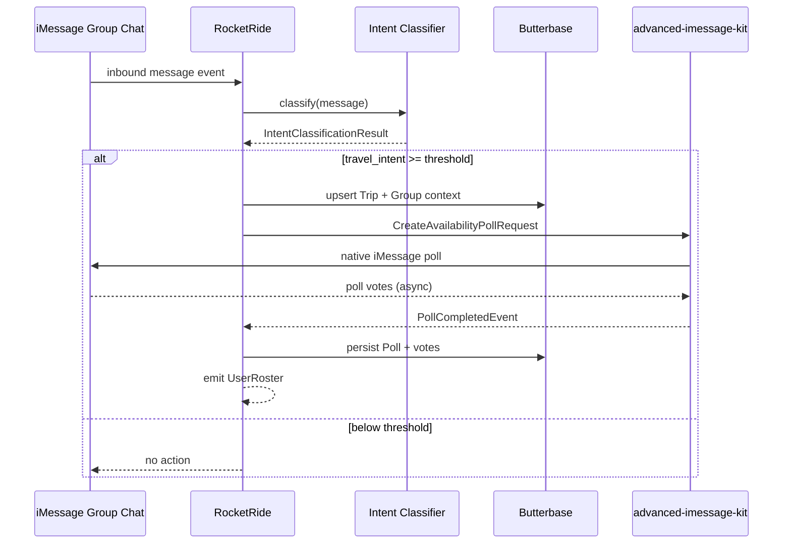

# Integration Contract: Intent Classification → Availability Poll → User Roster

**Status:** Draft  
**Branch:** `feature/photon-imessage-integration-contract`  
**Date:** 2026-06-05  
**Platform:** iMessage only

## Purpose

Define the boundary contract between Reunion's intent layer and Photon's iMessage layer for the first coordination artifact: a native availability poll sent to the group chat, ending with a structured user roster.

Transport and polls use `@photon-ai/advanced-imessage-kit`. Spectrum (`spectrum-ts` + iMessage provider) may handle inbound webhooks; poll create/vote/parse always goes through advanced-imessage-kit.

## Flow overview



## Step 1 — Input: Intent classification

Produced by RocketRide's first-pass classifier (ADR-007, ADR-014). Downstream steps MUST NOT run unless this contract's gate passes.

### `IntentClassificationResult`

```json
{
  "message_id": "string",
  "chat_guid": "string",
  "platform": "imessage",
  "text": "string",
  "classified_at": "ISO-8601",
  "travel_intent": {
    "detected": true,
    "confidence": 0.0,
    "signal": "explicit_planning | destination_mention | date_mention | mixed"
  },
  "extracted": {
    "destination": "string | null",
    "timeframe": "string | null",
    "participants_mentioned": ["string"]
  },
  "should_orchestrate": true
}
```

### Gate rules

| Rule | Value |
|------|-------|
| `should_orchestrate` | Must be `true` |
| `travel_intent.detected` | Must be `true` |
| `travel_intent.confidence` | Must be ≥ `0.6` (tunable) |
| `platform` | Must be `imessage` |
| Required routing field | `chat_guid` (e.g. `iMessage;+;chat123456`) |

If the gate fails, the pipeline returns `NoOp` and does not call the iMessage SDK.

## Step 2 — Action: Create availability poll

RocketRide emits a `CreateAvailabilityPollRequest` to the iMessage adapter.

### `CreateAvailabilityPollRequest`

```json
{
  "correlation_id": "uuid",
  "trip_id": "uuid | null",
  "target": {
    "chat_guid": "string",
    "platform": "imessage"
  },
  "poll": {
    "title": "Can everyone make this trip?",
    "options": ["Can you go", "Do you want to go"],
    "kind": "availability"
  },
  "context": {
    "destination": "string | null",
    "timeframe": "string | null",
    "trigger_message_id": "string"
  }
}
```

### Poll semantics

| Option | Meaning |
|--------|---------|
| **Can you go** | Participant is available / willing under current constraints |
| **Do you want to go** | Participant wants to go but may have open constraints |

### iMessage adapter

```typescript
import { SDK } from "@photon-ai/advanced-imessage-kit";

const poll = await sdk.polls.create({
  chatGuid: request.target.chat_guid,
  title: request.poll.title,
  options: request.poll.options,
});
```

### `CreateAvailabilityPollResponse`

```json
{
  "correlation_id": "uuid",
  "poll_id": "uuid",
  "external_poll_guid": "string",
  "status": "sent | failed",
  "sent_at": "ISO-8601",
  "error": "string | null"
}
```

`external_poll_guid` maps to `poll.guid` from `sdk.polls.create`.

## Step 3 — Async: Collect votes

The iMessage adapter listens on `sdk.on('new-message')` and normalizes poll vote events.

```typescript
import {
  isPollMessage,
  isPollVote,
  parsePollVotes,
  getOptionTextById,
} from "@photon-ai/advanced-imessage-kit";

sdk.on("new-message", (message) => {
  if (!isPollMessage(message) || !isPollVote(message)) return;
  const vote = parsePollVotes(message);
  // normalize to PollVoteRecord
});
```

### iMessage vote event (native)

```json
{
  "event": "poll_vote",
  "poll_message_guid": "string",
  "chat_guid": "string",
  "votes": [
    {
      "participant_handle": "+14155551234",
      "option_identifier": "string",
      "option_text": "Can you go"
    }
  ]
}
```

### Normalized `PollVoteRecord`

```json
{
  "poll_id": "uuid",
  "participant_handle": "string",
  "option_text": "Can you go | Do you want to go",
  "voted_at": "ISO-8601"
}
```

### Completion trigger

Emit `PollCompletedEvent` when either:

- All known group participants have voted, or
- A timeout elapses (default: 24h for demo, 48h production), or
- An operator sends `what's next?` / `summarize the trip`

## Step 4 — Output: User roster (terminal artifact)

The flow **ends** by emitting a `UserRoster` JSON object. This is the handoff to Butterbase memory writes and downstream coordination.

### `UserRoster`

```json
{
  "correlation_id": "uuid",
  "trip_id": "uuid",
  "poll_id": "uuid",
  "generated_at": "ISO-8601",
  "users": [
    {
      "name": "Alice Chen",
      "phone_number": "+14155551234"
    },
    {
      "name": "Bob Martinez",
      "phone_number": "+14155559876"
    }
  ]
}
```

### `User` field rules

| Field | Type | Source | Required |
|-------|------|--------|----------|
| `name` | `string` | `sdk.contacts.getContactCard(handle)` → `displayName` or `firstName lastName`; fallback to `participant_handle` | Yes |
| `phone_number` | `string` | E.164 from `participant_handle` | Yes |

### Inclusion rules

A user appears in `users` when:

1. They are a participant in the target iMessage group chat, **and**
2. They cast a vote on the availability poll.

Non-voters are excluded from the roster but may be tracked separately in Butterbase as `TripParticipant.status = "pending"`.

### Name resolution algorithm

```
for each voted participant_handle:
  card = sdk.contacts.getContactCard(handle) ?? null
  name = card.displayName
      ?? trim(card.firstName + " " + card.lastName)
      ?? handle
  phone_number = normalizeE164(handle)
  append { name, phone_number }
```

## Error contract

| Error code | Condition | Behavior |
|------------|-----------|----------|
| `INTENT_GATE_FAILED` | Classifier below threshold | NoOp, no SDK call |
| `MISSING_CHAT_GUID` | `chat_guid` absent or invalid | Fail fast, log |
| `POLL_SEND_FAILED` | `sdk.polls.create` error | Retry 2x, then surface to chat |
| `PARTIAL_ROSTER` | Timeout with <100% votes | Emit roster with voted users only; flag `complete: false` |

## Idempotency

- `correlation_id` is generated once per intent-triggered poll.
- Duplicate classifier hits for the same `message_id` MUST NOT create duplicate polls.
- Butterbase stores `(trip_id, poll.kind)` unique constraint for `availability`.

## Observability (demo / judges)

RocketRide pipeline stages should log:

1. `intent.classified` — confidence + extracted entities
2. `poll.requested` — `chat_guid` + options
3. `poll.sent` — `external_poll_guid`
4. `poll.vote.received` — per `participant_handle`
5. `roster.emitted` — final `users` array

## Open decisions

1. **Inbound path** — Spectrum iMessage webhooks vs direct `sdk.on('new-message')` for triggering the classifier.
2. **Completion timeout** — 24h demo default vs configurable per trip.
3. **Non-voter handling** — exclude from roster (current) vs include with `status: "unknown"`.

## Related docs

- `docs/connections/imessage.md`
- `docs/connections/photon-spectrum.md` — Spectrum iMessage provider (inbound only)
- `docs/PRD.md` — FR1, FR5, FR6
- `ADR/ADR-007` — local intent filter
- `ADR/ADR-013` — RocketRide orchestration
