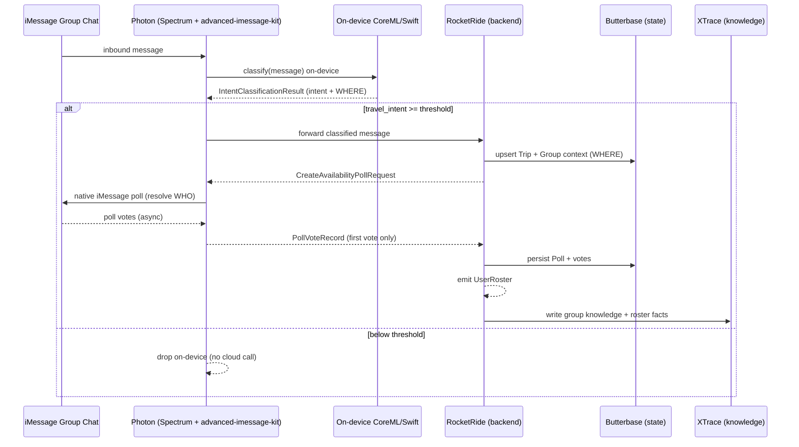

# Integration Contract: Intent Classification → Availability Poll → User Roster

**Status:** Draft  
**Branch:** `feature/photon-imessage-integration-contract`  
**Date:** 2026-06-05  
**Platform:** iMessage only

## Purpose

Define the boundary contract between Reunion's on-device intent layer and Photon's iMessage layer for the first coordination artifact: a native availability poll sent to the group chat, ending with a structured user roster.

**Intent runs on-device, before the cloud.** Photon grabs each inbound iMessage and calls an on-device CoreML/Swift classifier that resolves the **WHERE** (travel intent + destination). Only messages that pass the on-device gate are forwarded to the cloud backend. The backend then asks Photon to send a native poll that resolves the **WHO** (who is in). This keeps the local-filter-before-cloud posture of ADR-007 / ADR-014, now realized as an on-device model.

- **WHERE** — destination/timeframe, resolved on-device by the CoreML/Swift classifier.
- **WHO** — availability, resolved by the iMessage poll → roster.

**Photon is the iMessage connector.** Inbound text arrives via Spectrum (`spectrum-ts` + iMessage provider); poll create/vote/parse always goes through `@photon-ai/advanced-imessage-kit`. Photon also invokes the on-device classifier and bridges to the backend. Both Photon surfaces are shown as a single connector participant below.

## Integration boundaries (ownership)

The contract is the seam between independently built components. Each owner implements their side and taps in once their part is done:

| Component | Owner role | Responsibility |
|-----------|------------|----------------|
| **On-device classifier (CoreML / Swift)** | Intent (WHERE) | Classifies travel intent + destination on device; applies the gate before any cloud call |
| **Photon** | Connector | Inbound text (Spectrum webhook), calls the on-device classifier, bridges to the backend, native poll create/vote/parse (advanced-imessage-kit) |
| **RocketRide** | Backend orchestration | Receives classified messages from Photon, drives the poll flow, normalizes votes, emits the roster |
| **Butterbase** | Backend state | Transactional trip/poll/vote state and plan artifacts |
| **XTrace** | Knowledge | Stores group-chat knowledge: roster facts, participants, group context |

"Backend" = RocketRide orchestration + Butterbase state (+ XTrace knowledge). Photon hands the classified message to the backend and receives a poll request back.

## Flow overview



## Step 1 — Input: On-device intent classification

Produced on-device by the CoreML/Swift classifier (ADR-007, ADR-014), which Photon invokes for each inbound message. This step resolves the **WHERE** (intent + destination). The gate is applied on-device: only passing messages are forwarded to the cloud backend, so no cloud call happens for non-travel chatter.

### `IntentClassificationResult`

```json
{
  "message_id": "string",
  "chat_guid": "string",
  "platform": "imessage",
  "text": "string",
  "classified_at": "ISO-8601",
  "travel_intent": {
    "detected": true,
    "confidence": 0.0,
    "signal": "explicit_planning | destination_mention | date_mention | mixed"
  },
  "extracted": {
    "destination": "string | null",
    "timeframe": "string | null",
    "participants_mentioned": ["string"]
  },
  "should_orchestrate": true
}
```

### Gate rules

| Rule | Value |
|------|-------|
| `should_orchestrate` | Must be `true` |
| `travel_intent.detected` | Must be `true` |
| `travel_intent.confidence` | Must be ≥ `0.6` (tunable) |
| `platform` | Must be `imessage` |
| Required routing field | `chat_guid` (e.g. `iMessage;+;chat123456`) |

If the gate fails, the message is dropped on-device: Photon does not forward it to the backend, and no trip, poll, or cloud work is created.

## Step 2 — Action: Create availability poll (resolve WHO)

After Photon forwards a passing classification, the backend (RocketRide) upserts trip/group context from the WHERE and emits a `CreateAvailabilityPollRequest` back to Photon, which sends the native poll to resolve the WHO.

### `CreateAvailabilityPollRequest`

```json
{
  "correlation_id": "uuid",
  "trip_id": "uuid | null",
  "target": {
    "chat_guid": "string",
    "platform": "imessage"
  },
  "poll": {
    "title": "Can everyone make this trip?",
    "options": ["Yes", "No", "Maybe"],
    "kind": "availability"
  },
  "context": {
    "destination": "string | null",
    "timeframe": "string | null",
    "trigger_message_id": "string"
  }
}
```

### Poll semantics

| Option | Meaning |
|--------|---------|
| **Yes** | Participant is in / available for the trip |
| **No** | Participant cannot make it |
| **Maybe** | Tentative — wants to go but has open constraints |

### iMessage adapter

```typescript
import { SDK } from "@photon-ai/advanced-imessage-kit";

const poll = await sdk.polls.create({
  chatGuid: request.target.chat_guid,
  title: request.poll.title,
  options: request.poll.options,
});
```

### `CreateAvailabilityPollResponse`

```json
{
  "correlation_id": "uuid",
  "poll_id": "uuid",
  "external_poll_guid": "string",
  "status": "sent | failed",
  "sent_at": "ISO-8601",
  "error": "string | null"
}
```

`external_poll_guid` maps to `poll.guid` from `sdk.polls.create`.

### Participant snapshot

At poll creation, capture the target group's participant set via `sdk.chats.getChats()` → `participants` and persist it alongside the poll. This snapshot is the denominator for completion ("all voted") and for the pending set in a partial roster.

## Step 3 — Async: Collect votes

The iMessage adapter listens on `sdk.on('new-message')` and normalizes poll vote events.

```typescript
import {
  isPollMessage,
  isPollVote,
  parsePollVotes,
  getOptionTextById,
} from "@photon-ai/advanced-imessage-kit";

sdk.on("new-message", (message) => {
  if (!isPollMessage(message) || !isPollVote(message)) return;
  const vote = parsePollVotes(message);
  // normalize to PollVoteRecord, then apply first-vote-wins (see below)
});
```

### Vote uniqueness (v1: first-vote-wins)

A participant's **first** vote on a poll is persisted; subsequent votes for the same `(poll_id, participant_handle)` are **ignored** (no rewrites in v1). iMessage allows changing a vote, but v1 deliberately does not track revisions. Implement as insert-if-absent on `(poll_id, participant_handle)`; emit `vote.ignored` for later votes.

### iMessage vote event (native)

```json
{
  "event": "poll_vote",
  "poll_message_guid": "string",
  "chat_guid": "string",
  "votes": [
    {
      "participant_handle": "+14155551234",
      "option_identifier": "string",
      "option_text": "Yes"
    }
  ]
}
```

### Normalized `PollVoteRecord`

```json
{
  "poll_id": "uuid",
  "participant_handle": "string",
  "option_identifier": "string",
  "option_text": "Yes | No | Maybe",
  "voted_at": "ISO-8601"
}
```

`option_identifier` is retained as the stable key from the native event; `option_text` is the human-readable label resolved via `getOptionTextById`.

### Completion trigger

Emit `PollCompletedEvent` when either:

- All known group participants have voted, or
- A timeout elapses (default: 24h for demo, 48h production), or
- An operator sends `what's next?` / `summarize the trip`

## Step 4 — Output: User roster (terminal artifact)

The flow **ends** by emitting a `UserRoster` JSON object. This is the knowledge handoff: roster facts and group context are written to **XTrace** (the group-chat knowledge layer), while poll/trip/vote **state** already lives in Butterbase.

### `UserRoster`

```json
{
  "correlation_id": "uuid",
  "trip_id": "uuid",
  "poll_id": "uuid",
  "generated_at": "ISO-8601",
  "complete": true,
  "users": [
    {
      "name": "Alice Chen",
      "phone_number": "+14155551234",
      "availability": "yes"
    },
    {
      "name": "Bob Martinez",
      "phone_number": "+14155559876",
      "availability": "maybe"
    }
  ]
}
```

`complete` is `true` when every participant in the snapshot voted; `false` when the roster is emitted on timeout (see `PARTIAL_ROSTER`).

### `User` field rules

| Field | Type | Source | Required |
|-------|------|--------|----------|
| `name` | `string` | Contacts lookup via `nameMap.get(handle)` (built from `sdk.contacts.getContacts()`); fallback to `participant_handle` | Yes |
| `phone_number` | `string` | E.164 from `participant_handle` | Yes |
| `availability` | `"yes" \| "no" \| "maybe"` | The participant's persisted (first) vote `option_text`, lowercased | Yes |

### Inclusion rules

A user appears in `users` when:

1. They are a participant in the target iMessage group chat, **and**
2. They cast a vote on the availability poll (any of `Yes` / `No` / `Maybe`).

Their `availability` carries the actual vote, so downstream consumers (not this contract) decide who is "in." Non-voters are excluded from the roster but may be tracked separately in Butterbase as `TripParticipant.status = "pending"`.

### Name resolution algorithm

```
contacts = sdk.contacts.getContacts()
nameMap = {}
for each c in contacts:
  name = c.displayName ?? c.firstName ?? ""
  for each address in (c.phoneNumbers + c.emails):
    if name: nameMap[address] = name

for each voted participant_handle:
  name = nameMap[handle] ?? handle
  phone_number = normalizeE164(handle)
  availability = lowercase(first_vote.option_text)
  append { name, phone_number, availability }
```

## Error contract

| Error code | Condition | Behavior |
|------------|-----------|----------|
| `INTENT_GATE_FAILED` | On-device classifier below threshold | Drop on-device, no cloud/backend call |
| `MISSING_CHAT_GUID` | `chat_guid` absent or invalid | Fail fast, log |
| `POLL_SEND_FAILED` | `sdk.polls.create` error | Retry 2x, then surface to chat |
| `PARTIAL_ROSTER` | Timeout with <100% votes | Emit roster with voted users only; set `complete: false` |

Vote changes are not an error: a later vote for an already-voted `(poll_id, participant_handle)` is silently dropped and logged as `vote.ignored`.

## Idempotency

- `correlation_id` is generated once per intent-triggered poll.
- **Poll-creation dedup key:** `trigger_message_id`. Duplicate classifier hits for the same `message_id` MUST NOT create duplicate polls. When `trip_id` is null, dedup additionally on `(chat_guid, poll.kind)` so the first availability poll for a chat isn't duplicated before a trip exists.
- Butterbase stores a `(trip_id, poll.kind)` unique constraint for `availability` once `trip_id` is assigned.
- **Vote dedup:** first vote per `(poll_id, participant_handle)` wins (see Step 3).

## Observability (demo / judges)

Pipeline stages should log:

1. `intent.classified` — on-device confidence + extracted WHERE (destination/timeframe)
2. `intent.forwarded` — passing message handed from Photon to the backend
3. `poll.requested` — `chat_guid` + options
4. `poll.sent` — `external_poll_guid`
5. `poll.vote.received` — per `participant_handle`
6. `vote.ignored` — duplicate vote dropped (first-vote-wins)
7. `roster.emitted` — final `users` array + `complete`
8. `knowledge.written` — roster + group context persisted to XTrace

## Resolved decisions

1. **Intent location** — classification runs on-device (CoreML/Swift), invoked by Photon, before any cloud call. WHERE is resolved here; WHO is resolved by the poll.
2. **Inbound path** — Photon receives inbound iMessage (Spectrum), calls the on-device classifier, and forwards only passing messages to the backend; poll **votes** always arrive via advanced-imessage-kit `sdk.on('new-message')`.
3. **Poll options** — `Yes` / `No` / `Maybe`.
4. **Vote changes** — first-vote-wins in v1; no revisions tracked.

## Open decisions

1. **Completion timeout** — 24h demo default vs configurable per trip.
2. **Non-voter representation in XTrace** — omit (current) vs record as `status: "pending"` knowledge.

## Related docs

- `docs/connections/imessage.md`
- `docs/connections/photon-spectrum.md` — Spectrum iMessage provider (inbound only)
- `docs/PRD.md` — FR1, FR5, FR6
- `ADR/ADR-007` — local intent filter (realized as on-device CoreML/Swift)
- `ADR/ADR-013` — RocketRide orchestration
- `ADR/ADR-014` — filter intent before cloud orchestration
